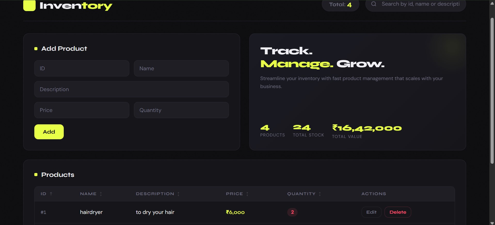

# Inventory Manager

A full-stack inventory management web app built with FastAPI, PostgreSQL, and vanilla HTML/CSS/JS.

## Preview


## Features
- Add, edit, and delete products
- Search by ID, name, or description
- Sort by any column
- Live stats — total products, stock count, and inventory value
- Clean dark-themed UI

## Tech Stack
- **Backend** — FastAPI (Python)
- **Database** — PostgreSQL + SQLAlchemy
- **Frontend** — HTML, CSS, JavaScript

## How to Run Locally

**1. Clone the repo**
```
git clone https://github.com/teestakar/inventory-manager.git
```

**2. Install dependencies**
```
pip install fastapi uvicorn sqlalchemy psycopg2-binary
```

**3. Set up your PostgreSQL database**
```
Update the database URL in database.py with your credentials
```

**4. Run the server**
```
uvicorn main:app --reload
```

**5. Open index.html in your browser**

## API Endpoints
| Method | Endpoint | Description |
|--------|----------|-------------|
| GET | /products | Get all products |
| GET | /products/{id} | Get product by ID |
| POST | /products | Add a product |
| PUT | /products/{id} | Update a product |
| DELETE | /products/{id} | Delete a product |
```
